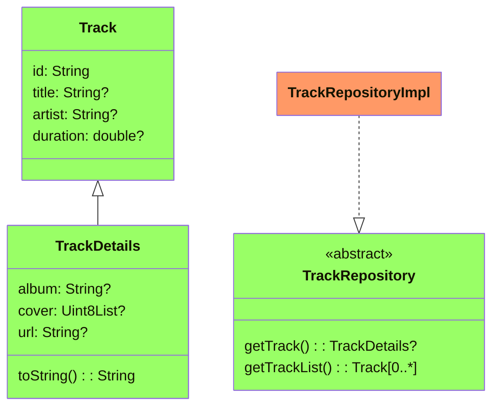
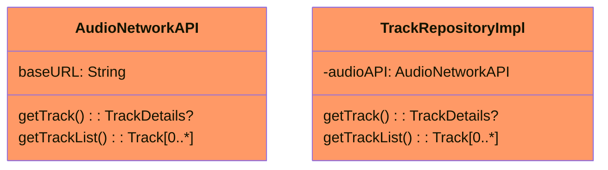
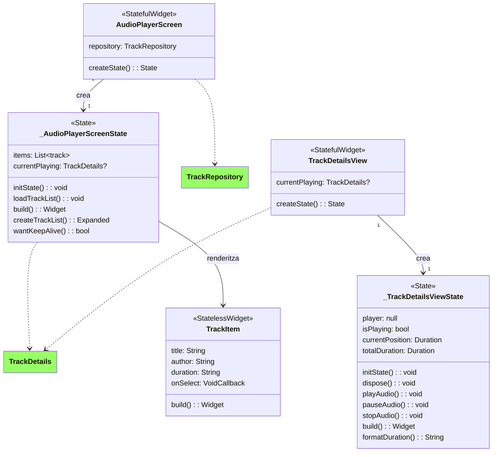

# Client multimèdia

Una app per veure el funcionament del la llibreria AudioPlayers i alguns conceptes de Flutter i arquitectura en funcionament.

## Modificacions al projecte Android

L'aplicació requereix d'accés a Internet, pel que hem hagut d'especificar-ho explícitament al fitxer `AndroidManifest.xml`, ubicat en `android/app/src(main/AndroidManifest.xml` amb el següent codi;

```xml
<manifest ...>
    <!-- Cal permís d'accés a Internet per obtenir les pistes -->
    <uses-permission android:name="android.permission.INTERNET" />
    <application
        ...
        android:usesCleartextTraffic="true">  <!-- Per utilitzar directament http-->
        ...
    </application>
    ...
</manifest>
```

Per altra banda, la llibreria AudioPlayers requereix de la versió 25 de l'[Android NDK](https://developer.android.com/ndk) una llibreria per implementar parts del codi amb llenguatge natiu en C i C++.

L'error que obrindrem si no ho modifiquem serà:

```
Your project is configured with Android NDK 23.1.7779620, but the following plugin(s) depend on a different Android NDK version:
- audioplayers_android requires Android NDK 25.1.8937393
- path_provider_android requires Android NDK 25.1.8937393
Fix this issue by using the highest Android NDK version (they are backward compatible).
Add the following to /home/usuari/FlutterProjects/client_multimedia/android/app/build.gradle:

    android {
        ndkVersion = "25.1.8937393"
        ...
    }
```

Així que afegim aquesta modificació al fitxer `android/app/build.gradle` (compte, NO el confoneu amb l'`android/build.gradle`):

```groovy
android {
    ...
    // ndkVersion = flutter.ndkVersion // Comentem aquesta línia
    ndkVersion = "25.1.8937393"  // I afegim la nova versió
}
```

## Arquitecura CLEAN amb Flutter

*CLEAN* és una arquitectura de programari que se centra en la separació de responsabilitats entre diferents capes per aconseguir un codi més modular, escalable i fàcil de mantenir. Aquesta arquitectura va ser definida per Robert C. Martin (Uncle Bob) i és independent del framework o llenguatge que s’utilitze, podent aplicar-setant a aplicacions web, mòbils, com a serveis backend.

Els objectius i beneficis d'aquesta arquitectura són:

1. **Desacoblament**: Cada capa té responsabilitats ben definides i no depèn directament de les implementacions de les altres.
2. **Escalabilitat**: Permet afegir noves funcionalitats o modificar existents sense afectar altres parts del sistema.
3. **Testabilitat**: Gràcies al desacoblament, cada capa pot ser provada per separat.
4. **Claredat**: L’organització del codi facilita la navegació i la comprensió per part de diferents equips de desenvolupament.

### Capes de l'arquitectura

Tot i que pot tenir variacions, podem establir les següents capes en l'arquitectura:

* **Capa de presentació (Presentation Layer)**: S'encarrega de la interfície de l'usuari i la interacció amb aquest. Té la responsabilitat de mostrar les ddes obtingudes de la capa de domini i enviar cap a aquesta les accions de l'usuari.

* **Capa de domini (Domain Layer)**: És el nucli de l’aplicació i conté la lògica de negoci. Entre les seues responsabilitats està la definició de les entitats o models centrals que representen el negoci, la definició (opcional) de casos d'ús, amb la lògica de l'aplicació que defineix com interactuen les dades i la definició de les interfícies de repositori que connecten amb la capa d'infrastructura.

* **Capa d'infrastructura (Infrastructure/Data Layer)**: Gestiona l'accés a les fonts de dades (APIs, bases de dades, serveis externs), i té les responsabilitats de la implementació de les interfícies de repositori definides a la capa de Domini, de la gestió d'oparacions d'obtenció de dades com crides HTTP o operacions amb bases de dades.

* **Capa Core o configuració global**: Una capa opcional, que inclou diverses utilitats compartides entre les diferents capes. Tot i que és una capa opcional, pot ajudar a organitzar codi genèric.

Entre les diferents capes hi ha una relació de dependència, de manera que la capa de presentació depèn de la capa de domini i aquesta de la d'infrastructura, però en principi, la capa de domini no depèn de cap implementació concreta.

Al nostre projecte, aquesta estructura es concreta en el següent:

#### 1. Capa de Domini

Dividim aquesta capa en dos components:

* Capa d'**Entitats (`entities`)**, que representen conceptes centrals de l’aplicació com `Track` i `TrackDetails`. Aquests models són simples i agnòstics de com es recuperen o processen les dades.
* Cala de **Repositoris (`repository`)**, on es defineixen interfícies que especifiquen les operacions que es poden realitzar sobre les dades, com `TrackRepository`. Les implementacions concretes es defineixen en la capa d’infraestructura.

En principi, aquesta capa és independent de com es gestionen les dades, pel que podem substituir la font de dades (per exemple, canviar d’API REST a una base de dades) sense modificar la lògica del domini.



#### 2. Capa d’Infraestructura

Com hem comentat, aquesta capa implementa els mecanismes per accedir a dades externes com APIs o bases de dades. Aquesta capa és responsable de com es recuperen les dades definides a la capa de domini.

Els components en els què dividim aquesta capa seran:

- **Fonts de Dades (`data_sources`)**: Conté implementacions concretes per interactuar amb serveis externs. En aquest cas, `AudioNetworkAPI` és responsable de comunicar-se amb l’API REST del servidor.
- **Implementació del Repositori (`TrackRepositoryImpl`)**: Aquesta classe connecta les fonts de dades (`AudioNetworkAPI`) amb les interfícies del repositori definides a la capa de domini.

Amb aquest aorganització fem una abstracció del repositori, que permet que els components de l’aplicació no coneguen els detalls de com es gestionen les dades (com URLs d’API o protocols HTTP).



#### 3. Capa de Presentació

Com hem dit, s'encarrega de la gestió de la interfície i la interacció amb l’usuari, i inclou tant les pantalles com els widgets i temes.

Aquesta capa es compon de:

* **Pantalles (`screens`)**: Representen pantalles completes de l’aplicació, com `AudioPlayerScreen`, que mostra una llista de pistes d’àudio i permet seleccionar-ne una per reproduir-la.
* **Ginys Reutilitzables (`widgets`)**: Inclou ginys com `TrackItem` i `TrackDetailsView` per mostrar informació específica de les pistes d’àudio.
* **Temes (`themes`)**: Defineix la configuració d’estil global de l’aplicació, com `AppTheme`.

Amb aquesta organització, la capa de presentació només depèn de la interfície de la capa de domini (`TrackRepository`) i no dels detalls concrets d’accés a dades, amb el que es facilita la prova de la interfície i la reutilització de components.



#### Estructura Completa del Projecte

amb això, l'estructura de carpetes que se'ns queda és:
```
lib
├── domain
│   ├── domain.dart                     # Punt d'entrada de la capa de domini
│   ├── entities
│   │   ├── entities.dart               # Exporta totes les entitats
│   │   ├── track.dart                  # Entitat base per a les pistes
│   │   └── track_details.dart          # Detalls complets d'una pista
│   └── repository
│       ├── track_repository.dart       # Interfície del repositori
│       └── track_repository_impl.dart  # Implementació del repositori
├── infrastructure
│   └── data_sources
│       ├── api
│       │   ├── api_data_sources.dart   # Exporta fonts de dades
│       │   └── audio_network_api.dart  # Gestió de l'API REST
│       └── data_sources.dart           # Punt d'entrada per fonts de dades
├── main.dart                           # Punt d'entrada de l'aplicació
└── presentation
    ├── presentation.dart               # Punt d'entrada de la capa de presentació
    ├── screens
    │   └── audio_player_screen.dart    # Pantalla principal per l'usuari
    ├── themes
    │   └── app_theme.dart              # Configuració del tema global
    └── widgets
        ├── track_details_view.dart     # Vista detallada d'una pista
        └── trackitem.dart              # Element de llista de pistes
```
